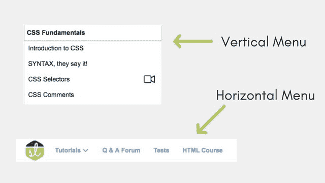
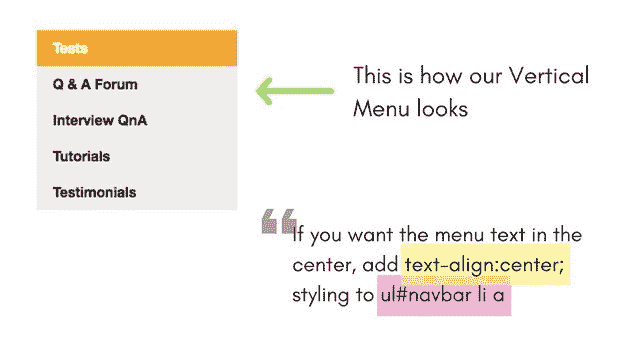

# CSS:创建导航栏

> 原文：<https://www.studytonight.com/cascading-style-sheet/css-navigation-bar-style>

每个网站都需要一个导航条来帮助访问者浏览网站。这通常通过放置顶部水平导航栏或侧面垂直导航栏来实现。

导航栏是使用 HTML 列表结合 CSS 创建的，使其看起来更像一个带有多个选项的菜单。

**示例:**



* * *

## 垂直导航栏

一个简单的列表是一个垂直的导航栏，如果我们让每个列表项都成为一个超链接。

```
<ul id="navbar">
    <li><a href="/tests">Tests</a></li>
    <li><a href="/studyroom">Q & A Forum</a></li>
    <li><a href="/flashcards">Interview QnA</a></li>
    <li><a href="/library">Tutorials</a></li>
    <li><a href="/testimonials">Testimonials</a></li>
</ul> 
```

上面的列表可以通过添加一些简单的 CSS 属性来设置样式:

CSS:

```
#navbar {
    list-style-type: none;
    margin: 0;
    padding: 0;
    width: 200px;
    background-color: #EEEEEE;
}

ul#navbar li a {
    display: block;
    color: #000000;
    font-weight:bold;
    padding: 8px 16px;
    text-decoration: none;
}

ul#navbar li a:hover {
    background-color: orange;
    color: white;
} 
```

最好使用一些`id`或`class`来提供这样的造型。因为如果我们直接对`ul`和`li`元素进行样式化，如下例所示，

```
ul {
    list-style-type: none;
    margin: 0;
    padding: 0;
    width: 200px;
    background-color: #EEEEEE;
}

li a {
    display: block;
    color: #000000;
    font-weight:bold;
    padding: 8px 16px;
    text-decoration: none;
}

li a:hover {
    background-color: orange;
    color: white;
} 
```

那么我们网站上的所有列表都将看起来像一个导航栏，而我们的网站上只需要一个导航栏，因此我们在我们的列表中使用了标识符`navbar`，这意味着只有带有`navbar`标识符的列表元素应该这样设置。

`ul#navbar`表示，一个`ul`列表元素带有`id = "navbar"`

[现场示例→](/code/playground/web?file=css-creating_vertical_navbar_1)



* * *

## 水平导航栏

当我们创建水平导航栏时，主要问题是如何将垂直的基本列表转换为水平列表。这可以通过两种不同的方式实现:

* * *

#### 使用`display:inline`

我们可以使用 CSS 属性`display:inline;`删除每个列表项前后的换行符，因为默认情况下列表项都添加了属性`display:block;`。

```
ul#navbar li{
    display: inline;
} 
```

[现场示例→](/code/playground/web?file=css-creating_horizontal_navbar_1)

* * *

#### 使用`float:left`

创建水平导航栏的另一种方法是向所有列表项添加`float:left;` CSS 属性。因此他们会排成一行。

下面是 CSS 代码:

```
#navbar {
    list-style-type: none;
    margin: 0;
    padding: 0;
    overflow: hidden;
    background-color: #EEEEEE;
}

ul#navbar li {
    float:left;
}

ul#navbar li a {
    display: block;
    color: #000000;
    font-weight:bold;
    padding: 8px 16px;
    text-decoration: none;
}
```

下面我们已经解释了，为什么我们使用了我们在上面的 CSS 代码中使用的东西，从列表项开始:

*   `float:left;` →使所有列表项向左浮动，使其排成一行。
*   `overflow: hidden;` →现在由于所有列表项都添加了属性`float:left`，因此列表项将不再在`ul`列表中，导致`ul`列表占据最小高度，在本例中该高度为零。我们应用了一种背景色来证明这一点。因此，这里使用了`overflow`黑客。我们没有使用`overflow:auto;`，因为它有时会添加一个滚动条，这是我们不想要的。
*   `display: block;` →使用这个 CSS 属性，我们使整个链接区域可点击，而不仅仅是链接文本。
*   `padding:8px 16px;` →我们增加了一个`8px 16px`的[填充](/cascading-style-sheet/css-padding)，也就是说在链接的顶部和底部会增加一个`8px`的空格，左右两侧会增加一个`16px`的空格。我们添加了填充，使我们的导航菜单看起来宽敞整洁。

[现场示例→](/code/playground/web?file=css-creating_horizontal_navbar_2)

* * *

* * *