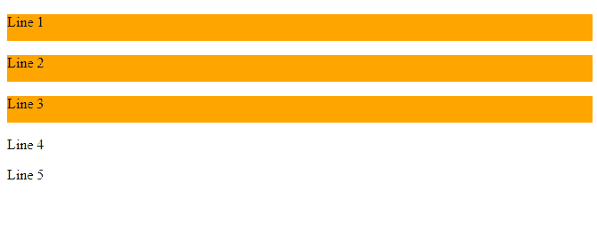
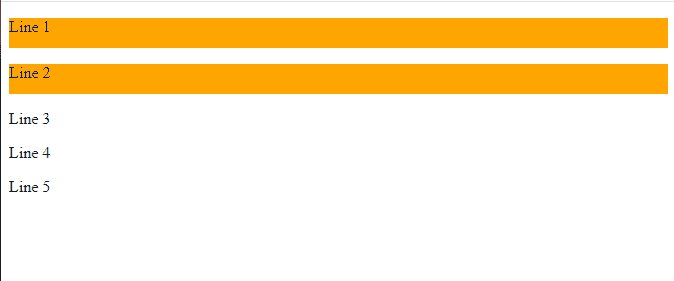
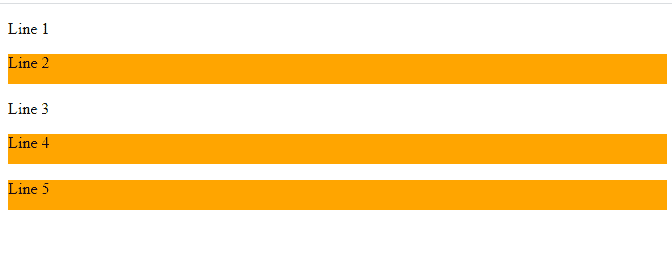

# CSS 组合器

> 原文：<https://www.studytonight.com/cascading-style-sheet/css-combinators>

CSS 组合符代表两个选择器之间的关系。CSS 选择器是可用于设计特定 HTML 元素样式的模式。有时，可能有不止一个简单选择器，为了组合多个简单选择器，我们使用组合器。

## CSS 中组合符的类型

组合子有 4 种类型，如下所示:

1.  后代选择器()(空格)
2.  子选择器(>)
3.  相邻同级选择器(+)
4.  常规同级选择器(~)

## CSS 中的后代选择器

当我们想要给多个元素赋予相同的样式，然后通过在它们之间应用空格(后代选择器)来分离所有的选择器时，使用后代选择器。使用后代选择器可以分离的所有选择器应该是元素的直接子元素，或者比 4-5 层更深，但是所有元素应该有相同的祖先。

### CSS 中后代选择器的语法

后代选择器的语法如下:

```
div h4{

/* styling properties*/
property: value;

}
```

## 示例:CSS 中的后代选择器

在给定的例子中，我们使用两个选择器`div`和`p`。因此，指定的 CSS 属性只被那些`p`选择器接受，它们是`div element`的后代。

```
<!DOCTYPE html>
<html>
<head>
	<title>Descendant Selector</title>
	<style>
		div p{
			background-color: orange;
			height: 30px;
			width: 100%;
		}
	</style>
</head>
<body>
<div>
	<p>Line 1</p>
	<p>Line 2</p>
	<p>Line 3</p>
</div>
<p>Line 4</p>
<p>Line 5</p>
</body>
</html>
```

### 输出:

正如我们在输出中看到的，CSS 属性只应用于那些 `<p>`元素，它们是`<div>`元素的子元素。



## 子选择器

子选择器使用大于号`(>)` 来分隔元素。当我们想要将样式属性应用于特定 HTML 元素的直接子元素时，使用子选择器。这个组合子比后代选择器严格得多，只有当第二个选择器是第一个选择器的直接子选择器时，才会获得样式属性。

### CSS 中子选择器的语法

子选择器的语法如下:

```
div > p {
/* styling properties*/

property: value;

}
```

## 示例:CSS 中的子选择器

在给定的例子中，我们已经使用`child selector (>)`为 div 元素指定了 CSS 属性。属性仅应用于那些`p` 元素，它们是 div 元素的直接子元素。剩余的 p 元素对 CSS 属性没有影响。

```
<!DOCTYPE html>
<html>
<head>
	<title>Child Selector</title>
	<style>
		div > p{
			background-color: orange;
			height: 30px;
			width: 100%;
		}
	</style>
</head>
<body>
<div>
	<p>Line 1</p>
	<p>Line 2</p>

</div>
<p>Line 3</p>
<p>Line 4</p>
<p>Line 5</p>
</body>
</html>
```

### 输出:

正如我们在输出图像上看到的，CSS 属性只适用于前两个元素`line 1`和`line 2`。这是因为我们已经使用`child selector`和 `first two lines are the direct child of the div element`为 `p element`指定了 CSS 属性。



## CSS 中的相邻兄弟选择器

当我们想要将 CSS 属性或样式应用于任何元素的相邻同级时，使用相邻同级选择器。兄弟元素应该有相同的父元素，并且第二个元素必须是第一个元素的直接从元素。通过在分隔符之间添加(+)符号来分隔选择器。

### CSS 中相邻同级选择器的语法

相邻同级选择器的语法如下:

```
div + p {
/* styling properties*/

property: value;

}
```

## 示例:CSS 中的相邻同级选择器

在给定的示例中，我们已经使用相邻的同级选择器将 CSS 属性应用于 HTML 元素。

```
<!DOCTYPE html>
<html>
<head>
	<title>Adjacent sibling Selector</title>
	<style>
		p + p{
			background-color: orange;
			height: 30px;
			width: 100%;
		}
	</style>
</head>
<body>
<div>
	<p>Line 1</p>
	<p>Line 2</p>

</div>
<p>Line 3</p>
<p>Line 4</p>
<p>Line 5</p>
</body>
</html>
```

### 输出:

正如我们在输出图像上看到的，CSS 属性仅应用于那些与任何其他`<p>`元素是直接兄弟的`<p>`元素。属性被`Line 2`、`Line 4`和`Line 5`获得，因为这三个是`<p>`元素的直系兄弟。



## CSS 中的通用同级选择器

当用户想要为彼此是兄弟的元素设置 CSS 属性时，即使它们不是直接的元素，也可以使用一般的兄弟选择器。当我们必须设置具有相同父元素的元素的样式属性时，使用这个选择器。可以通过在它们之间添加(~)符号来分隔这个选择器。

### CSS 中通用同级选择器的语法

下面给出了通用同级选择器的语法:

```
div ~ p {

/* styling properties*/

property: value;

}
```

## 示例:CSS 中的通用同级选择器

在本例中，样式属性由

元素的同级获得。

## 结论:

在本课中，我们已经学习了 CSS 组合符，以及如何使用 CSS 组合符来设计 HTML 元素的样式。此外，我们还学习了组合子的类型，如下所示:

1.  后代选择器()(空格)
2.  子选择器(>)
3.  相邻同级选择器(+)
4.  常规同级选择器(~)

* * *

* * *