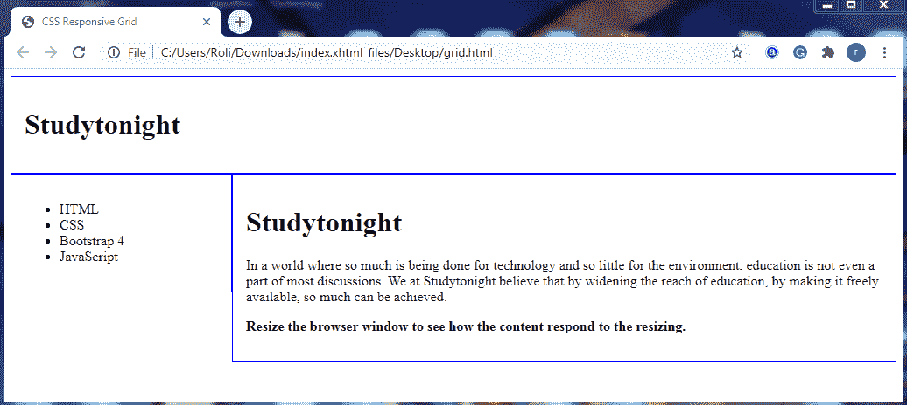

# CSS 响应式网格视图

> 原文：<https://www.studytonight.com/cascading-style-sheet/css-responsive-grid-view>

大多数网页由网格布局组成，这意味着页面分为行和列。借助这种网格布局，我们可以非常轻松高效地在网页上放置行和列。它允许我们将任意一行拆分为 12 列，最大宽度为 100%。当我们调整浏览器的大小时，这些网格元素会根据屏幕大小进行收缩和扩展。

## 在 CSS 中创建响应式网格视图

为了创建一个响应性的**网格视图**，我们必须为网页中的所有元素设置一个值为**的`box-sizing`属性边框**。这将包括将元件的**边框**和**边框**填充到元件的**高度**和**宽度**中。

*   给定的语法用于全局设置任何 CSS 属性，或者我们可以说用于所有的 HTML 元素。

```html
* {

box-sizing: border-box; 

}
```

*   我们使用 **< div >** 元素创建了一个标题，并分配了`.header`类来设置标题元素的 CSS 属性。为标题指定的 CSS 属性如下所示:

```html
.header {
  border: 1px solid blue;
  padding: 15px;
}
```

*   然后我们为主菜单创建了另一个 **< div >** ，并分配了类`.menu`。我们已经使用**<【ul】>**元素创建了一个无序列表，为其中的列表项添加了 **< li >** 元素 **< div >** 。应用于该元素的 **CSS 属性**如下所示:

```html
.menu {
  width: 25%;
  float: left;
  padding: 15px;
  border: 1px solid blue;
}
```

然后，第三个 **< div >** 用于创建描述列并分配类**。主**。应用于该元素的 **CSS 属性**如下所示:

```html
.main {
  width: 75%;
  float: left;
  padding: 15px;
  border: 1px solid blue;
}
```

### 超文本标记语言代码

下面是上面给出的解释的正确的 HTML 和 CSS 代码:

```html
<!DOCTYPE html>
<html>
<head>
<meta name="viewport" content="width=device-width, initial-scale=1.0">
<title>CSS Responsive Grid</title>
<style>
* {
  box-sizing: border-box;
}

.header {
  border: 1px solid blue;
  padding: 15px;
}

.menu {
  width: 25%;
  float: left;
  padding: 15px;
  border: 1px solid blue;
}

.main {
  width: 75%;
  float: left;
  padding: 15px;
  border: 1px solid blue;
}
</style>
</head>
<body>

<div class="header">
  <h1>Studytonight</h1>
</div>

<div class="menu">
  <ul>
    <li>HTML</li>
    <li>CSS</li>
    <li>Bootstrap 4</li>
    <li>JavaScript</li>
  </ul>
</div>

<div class="main">
  <h1>Studytonight</h1>
  <p>In a world where so much is being done for technology and so little for the environment, education is not even a part of most discussions. We at Studytonight believe that by widening the reach of education, by making it freely available, so much can be achieved.</p>
  <p><strong>Resize the browser window to see how the content respond to the resizing.</strong></p>
</div>

</body>
</html> 
```

### 输出:



## 实例:使用 CSS 创建响应式网格布局

这里演示了如何仅使用 HTML 和 CSS 创建一个响应性的网格布局。当您调整浏览器的大小时，您将看到网格布局如何在不同的屏幕大小上变化，而不会与另一个元素重叠。

## 结论

在本课中，我们学习了如何使用 CSS 属性创建具有行和列的响应式网格布局。

* * *

* * *