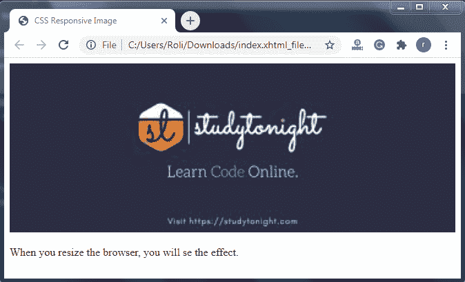
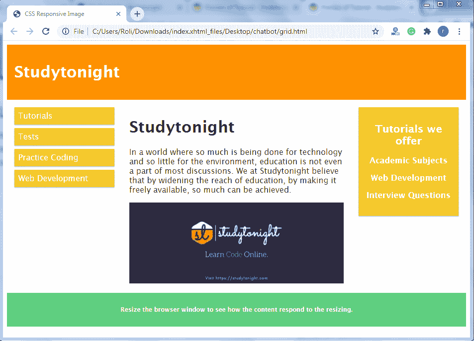
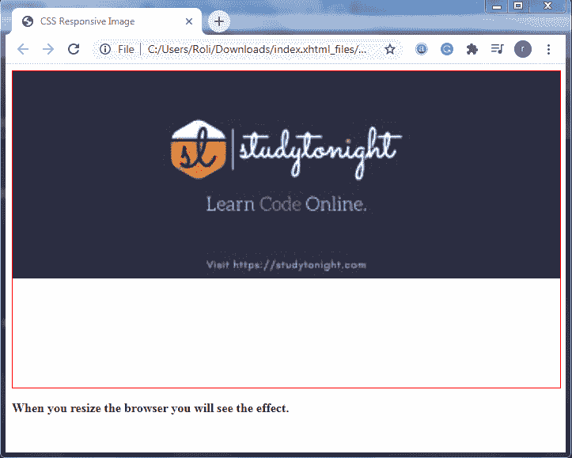
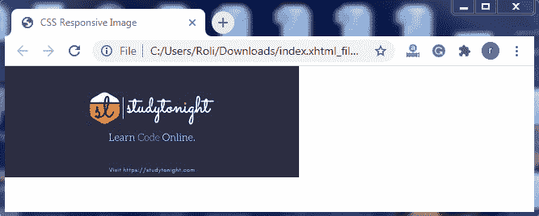

# CSS 响应式图像

> 原文：<https://www.studytonight.com/cascading-style-sheet/css-responsive-image>

如今，大多数人使用较小的设备(手机和平板电脑)而不是全屏设备(笔记本电脑、台式机)访问互联网。因此，非常有必要使网页具有响应性，以提供更好的用户界面和设备兼容性。

响应式图像也是响应网页布局的一部分。响应式图像是那些根据设备屏幕大小自动调整自身的图像。

要创建一个响应式图像，我们必须将宽度属性设置为百分比，高度设置为自动。通过将这两个属性应用于任何图像，图像将变得有响应，并根据设备的宽度自动调整自身。

### 示例:在 CSS 中创建响应式图像

在本例中，我们使用 CSS `width` 属性将图像的**宽度**设置为 **100%** 值，使用 CSS `height`属性将图像的**高度**设置为自动值。这两个属性使图像放大到比实际大小更大。

```
<!DOCTYPE html>
<html>
<head>
  <title>CSS Responsive Image</title>
<meta name="viewport" content="width=device-width, initial-scale=1.0">
<style>
img {
  width: 100%;
  height: auto;
}
</style>
</head>
<body>


<p><stronh>When you resize the browser, you will se the effect.</stronh></p>

</body>
</html> 
```

### 输出:

正如我们在输出中看到的，图像采用了整个可用宽度，这是因为我们将 width 属性的值指定为 100%。



## 使用 CSS 向网页添加图像

我们可以在响应网页中的任何地方添加图像。图像也可以根据设备宽度自动调整自身。

### 示例:使用 CSS 向网页添加图像

在这个例子中，我们在响应网页中添加了一个图像。

```
<!DOCTYPE html>
<html>
<head>
	<title>CSS Responsive Image</title>
<meta name="viewport" content="width=device-width, initial-scale=1.0">
<style>
* {
  box-sizing: border-box;
}

img {
  width: 100%;
  height: auto;
}

.row:after {
  content: "";
  clear: both;
  display: table;
}

[class*="col-"] {
  float: left;
  padding: 15px;
  width: 100%;
}

@media only screen and (min-width: 600px) {
  .col-s-1 {width: 8.33%;}
  .col-s-2 {width: 16.66%;}
  .col-s-3 {width: 25%;}
  .col-s-4 {width: 33.33%;}
  .col-s-5 {width: 41.66%;}
  .col-s-6 {width: 50%;}
  .col-s-7 {width: 58.33%;}
  .col-s-8 {width: 66.66%;}
  .col-s-9 {width: 75%;}
  .col-s-10 {width: 83.33%;}
  .col-s-11 {width: 91.66%;}
  .col-s-12 {width: 100%;}
}

@media only screen and (min-width: 768px) {
  .col-1 {width: 8.33%;}
  .col-2 {width: 16.66%;}
  .col-3 {width: 25%;}
  .col-4 {width: 33.33%;}
  .col-5 {width: 41.66%;}
  .col-6 {width: 50%;}
  .col-7 {width: 58.33%;}
  .col-8 {width: 66.66%;}
  .col-9 {width: 75%;}
  .col-10 {width: 83.33%;}
  .col-11 {width: 91.66%;}
  .col-12 {width: 100%;}
}

html {
  font-family: "Lucida Sans", sans-serif;
}

.header {
  background-color: #ff9100;
  color: #ffffff;
  padding: 15px;
}

.menu ul {
  list-style-type: none;
  margin: 0;
  padding: 0;
}

.menu li {
  padding: 8px;
  margin-bottom: 7px;
  background-color: #f5c92a;
  color: #ffffff;
  box-shadow: 0 1px 3px rgba(0,0,0,0.12), 0 1px 2px rgba(0,0,0,0.24);
}

.menu li:hover {
  background-color: #ff9100;
}

.aside {
  background-color: #f5c92a;
  padding: 15px;
  color: #ffffff;
  text-align: center;
  font-size: 14px;
  box-shadow: 0 1px 3px rgba(0,0,0,0.12), 0 1px 2px rgba(0,0,0,0.24);
}

.footer {
  background-color: #5fcf80;
  color: #ffffff;
  text-align: center;
  font-size: 12px;
  padding: 15px;
}
</style>
</head>
<body>

<div class="header">
  <h1>Studytonight</h1>
</div>

<div class="row">
  <div class="col-3 col-s-3 menu">
    <ul>
      <li>Tutorials</li>
      <li>Tests</li>
      <li>Practice Coding</li>
      <li>Web Development</li>
    </ul>
  </div>

  <div class="col-6 col-s-9">
    <h1>Studytonight</h1>
    <p>In a world where so much is being done for technology and so little for the environment, education is not even a part of most discussions. We at Studytonight believe that by widening the reach of education, by making it freely available, so much can be achieved.</p>

    
  </div>

  <div class="col-3 col-s-12">
    <div class="aside">
      <h2>Tutorials we offer</h2>
      <h3>Academic Subjects</h3>
      <h3>Web Development</h3>
      <h3>Interview Questions</h3>
    </div>
  </div>
</div>

<div class="footer">
  <p><strong>Resize the browser window to see how the content respond to the resizing.</strong></p>
</div>

</body>
</html> 
```

### 输出:



## CSS 中的背景图像

我们还可以使背景图像具有响应性。为了使背景图像具有响应性，我们必须设置背景大小属性。背景大小属性有三个值，它们是:

| **值** | **描述** |
| **包含** | 该值允许图像根据屏幕大小进行自我调整，并尝试适应内容区域。 |
| **盖** | 该值保持图像的纵横比，如果图像大小大于内容区域，则图像的某些部分可能会被剪裁。 |
| **100%** | 该值允许背景图像覆盖整个内容区域。 |

### 示例:使用 CSS 添加背景图像

在本例中，我们为图像指定了 CSS 属性`background-size`，其值**包含**，以使图像具有响应性。

```
<!DOCTYPE html>
<html>
<head>
	<title>CSSResponsive Image</title>
	<meta name="viewport" content="width=device-width, initial-scale=1.0">
	<style>
		div {
		  width: 100%;
		  height: 400px;
		  background-image: url('studyonight.jpg');
		  background-repeat: no-repeat;
		  background-size: contain;
		  border: 1px solid red;
		}
	</style>
</head>
<body>
	<div></div>
	<p><strong>When you resize the browser you will see the effect.</strong></p>
</body>
</html> 
```

### 输出:



## 使用 CSS 媒体查询

我们可以为不同的设备设置不同大小的图像，例如大图像，在全屏设备(笔记本电脑和台式机)上看起来很好，但这些图像对于小屏幕设备来说毫无用处。因此，我们使用媒体查询来设置不同设备上的不同图像。

### 示例:为图像指定媒体查询

在本例中，我们指定了媒体查询来使图像具有响应性。

```
<!DOCTYPE html>
<html>
<head>
	<title>CSS Responsive Image</title>
	<meta name="viewport" content="width=device-width, initial-scale=1.0">
	<style>
		/* For width smaller than 400px: */
		body {
		  background-repeat: no-repeat;
		  background-image: url('studyonight.jpg'); 
		}

		/* For width 400px and larger: */
		@media only screen and (min-width: 400px) {
		  body { 
		     background-image: url('studyonight.jpg'); 
		  }
		}
</style>
</head>
<body>
</body>
</html> 
```

### 输出:



## CSS 中的<picture>元素</picture>

`<picture>` HTML 元素与`<video>`和`<audio>`元素非常相似。借助这个元素，我们可以在`<picture>`元素内设置多个图像，最适合的图像正在屏幕上显示。

`<picture>`元素由零个或多个`<source>` 元素和一个`` 元素组成。浏览器会考虑每个`<source>`元素并从中选择最佳元素。如果没有找到匹配项或者浏览器不支持 `<picture>` 元素，那么将显示在``元素中指定的图像源。

**注:**我们也可以在`<source>` 元素的地方使用``元素。

## 示例:应用<picture>元素</picture>

在这个例子中，我们已经指定了打开和关闭`<picture>`元素，然后指定了`<source>`元素。`<source>`元素由两个属性 **srcset** 和**媒体**组成。`srcset` 属性用于指定图像的来源，**媒体**属性用于指定图像的媒体查询。

## 结论

在本课中，我们学习了如何创建一个响应式图像，根据设备的屏幕大小调整其高度和宽度。我们还学会了如何

*   添加响应性背景图像
*   使用媒体查询使图像具有响应性
*   使用<picture>元素添加图像</picture>

* * *

* * *