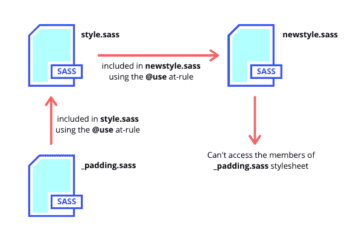

# SASS 部分

> 原文：<https://www.studytonight.com/sass/sass-partials>

SASS/SCSS 部分是 CSS 文件，包含特定样式的小型 **CSS** 代码，与主样式表分离，以便更好地管理 CSS 代码。这些文件可以在另一个 **SASS** 或 **SCSS** 文件中使用，而不是使用 [`@use` at-rule](https://www.studytonight.com/sass/sass-use-atrule) 或 [`@forward` at-rule](https://www.studytonight.com/sass/sass-forward-atrule) 再次编写相同的样式，这两个文件都包括具有不同可见性的样式表。

SASS Partials 提供了一个很好的方法来组织不同文件中的 CSS 代码，然后在任何需要的地方使用它们。

在 SASS 中一定要把样式表做成 Partial，它的名字应该总是以`_` **下划线字符**开头，例如**_ Partial . SCS，**等。

作为样式表名称前缀的下划线字符表示这是 CSS 的一小块，因此不需要单独将它编译成 CSS。

## 为什么要用 Partials？

Partials 用于将样式代码管理为功能性划分的样式规则，这些规则被划分为独立的文件，可以使用`@use` at-rule 在主样式表中使用。这样做有很多好处，

1.  您的主样式表将变得不那么庞大，并且您将能够更好地管理样式表。

2.  不编译部分代码，因此可以快速将 SASS 代码整体编译成 CSS。

3.  您可以根据自己的需求，使用`@use` at-rule 或`@forward` at-rule 来控制 Partials 中定义的样式代码的可见性。

考虑 **main.scss** 文件，它是样式的主文件，现在 **_partial.scss** 需要导入。

```
/* In the main.scss file */

@use 'partial'
```

注意导入时不使用 **`_`字符和文件扩展名。一旦我们包含了文件，那么部分中的所有内容都可以在主文件中使用。**

## 部分可见性控制

是的，当一个样式表包含在另一个样式表中时，SASS 允许我们控制它的成员的可见性。控制可见性有两种不同的方法:

1.  首先是通过在 Partials 中定义私有成员

2.  其次，当我们使用`@use` at 规则在样式表中包含分部时，如果该样式表(在其中导入分部)被任何其他样式表包含，则分部中定义的成员将不可见。在这种情况下，为了使分部成员可用，我们必须使用`@forward` at 规则。

### 野蛮民族党:私人成员

在 SASS/SCSS 中，我们可以通过在样式表中添加一个**连字符(-)** 或**下划线(_)** 作为名称前缀来定义私有成员。私有成员通常在其定义的样式表(部分)中工作，但是对于包含该部分的样式表，它们是不可见的。

让我们举个例子，

```
/* src/_corners.scss */
$-radius: 3px;

@mixin rounded {
  border-radius: $-radius;
}
```

现在如果我们将这个样式表导入到另一个样式表中，

```
/* style.scss */
@use "src/corners";

.button {
  @include corners.rounded;

  /* This is an error! $-radius isn't visible 
     outside of `_corners.scss`.
  */
  padding: 5px + corners.$-radius;
}
```

### 使用`@use`和`@forward`导入 SASS

当我们使用`@use` at 规则在样式表中包含分部时，如果该样式表(在其中导入分部)被任何其他样式表包含，则分部中定义的成员将不可见。在这种情况下，为了使分部成员可用，我们必须使用`@forward` at 规则。

如果我们使用`@use`at-规则，我们可以隐藏分部的成员以避免进一步使用。



在使用`@forward` at 规则时，也允许在进一步的导入中使用样式表中包含的部分。

## 结论:

就这样，我们结束了 Partials。SASS Partials 为我们提供了一种技术来**更好地管理我们的样式代码**和**有意义地隔离样式规则**。

* * *

* * *