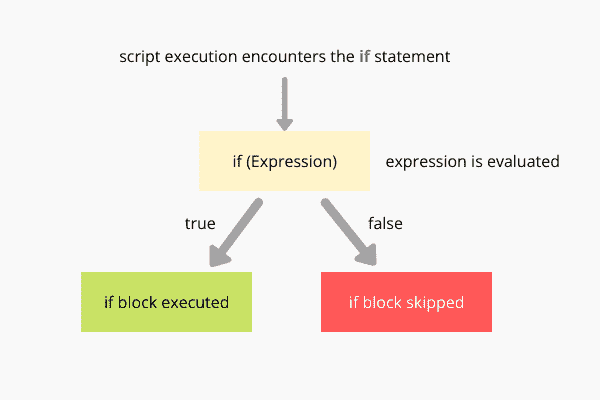
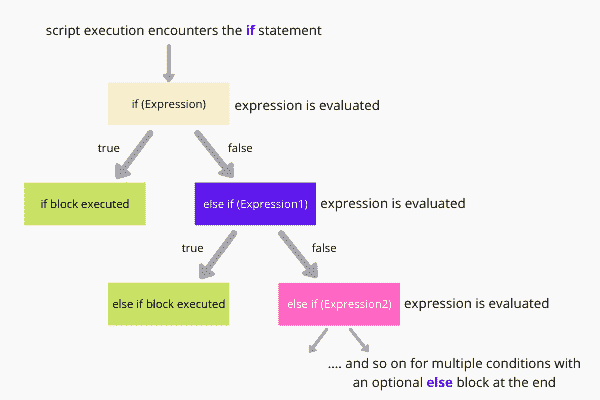

# JavaScript if、else 和 else if 语句

> 原文：<https://www.studytonight.com/javascript/javascript-if-else-and-else-if-statements>

在 JavaScript 中，为了根据条件控制程序或脚本的流程，我们可以使用`if...else`条件语句。if 和 else 条件语句的工作原理就像它们在通信时用于现实世界一样。比如看下面这个说法，*如果你分数超过 40%你就通过考试，否则你考试不及格*，这里**的条件是分数超过 40%** ，如果是真的那你就通过，如果是假的那你就不及格。

在 JavaScript 中，`if`是一个条件语句，用于控制程序流程，就像在 C、C++等编程语言中一样。根据条件控制程序的流程是最基本、最简单的方法之一。当我们只希望在特定条件为真时执行代码语句时，可以使用`if` 语句。

`if` 语句的条件包含在紧接`if` 关键字之后的**括号**中。

## JavaScript `if`:语法和使用

下面是在 JavaScript 代码中使用`if`语句的基本语法。

```
if(<EXPRESSION>)
{
    // block of statements
}
```

与`if`语句一起传递的条件主要是一个可以比较两个值的表达式，任何返回布尔输出**真/假**的表达式，或者任何其他表达式。此外，当表达式返回真或任何正数值时，将满足条件**，在这种情况下，将执行包含在`if`语句**下方花括号**内的**代码语句块**。**



### JavaScript `if`示例

在这个例子中，我们使用的是`if`语句，只有当表达式为**真**时，`if`块才会被执行。

现在让我们看看`if...else`块的组合在 JavaScript 中是如何工作的。

## JavaScript `if...else`:语法和使用

JavaScript `if`语句允许您创建一个带有条件的代码块，如果指定的条件为真，那么在`if`块中编写的代码语句将被执行。`else`语句还创建了一个代码块，该代码块仅在`if`语句中的指定条件为 **false** 时执行。

```
if(<EXPRESSION>)
{
    // if block
}
else
{
    // else block
}
```

`else`语句总是与`if`块后面的`if`语句一起使用。我们不能像使用`if`语句那样使用`else`语句提供条件/表达式。


### JavaScript `if...else`示例

在这个例子中，我们将使用一个`else`块以及和`if`语句和块。

现在我们已经学会了如何使用`if...else`语句，我们可以根据不同的条件让我们的脚本执行不同的代码语句。但是等等，如果我们的逻辑中有不止一个条件呢？我们应该使用多个`if`块吗？这个问题的答案将在下一节中讨论。

## JavaScript `if…else if`:语法和使用

JavaScript `else if`语句与`if`语句一起使用，定义多个不同的条件和代码块。当我们必须在脚本中实现多个条件时，我们可以在代码中使用`if`、`else if`和`else`语句。`else if`语句用在`if`和`else`语句之间，其中`else`不是强制性的。

下面我们有使用`else if`以及`if`和`else`语句的基本语法。

```
if(EXPRESSION1)
{
    // if block
}
else if(EXPRESSION2)
{
    // else if block
}
else if(EXPRESSION3)
{
    // another else if block
}
else
{
    // else block
}
```

在`if`语句之后，我们可以有任意多的`else if`块。此外，在末端有一个`else`块是可选的。



### JavaScript `if...else if`示例

在这个例子中，我们将使用`if`和`else if`语句来测试多个条件。

至此，我们已经完成了 JavaScript 流控制的基础知识，现在我们知道如何在 JavaScript 代码中实现基于条件的代码执行。例如，如果您想编写一个简单的脚本，其中您有一个 HTML 表单，您要求用户提供他们的详细信息，如姓名和性别。然后，根据他们输入的内容，您可以显示不同性别的自定义消息，或者类似地，根据任何其他条件集，您可以使用 JavaScript 在用户界面中执行不同的操作。

* * *

* * *