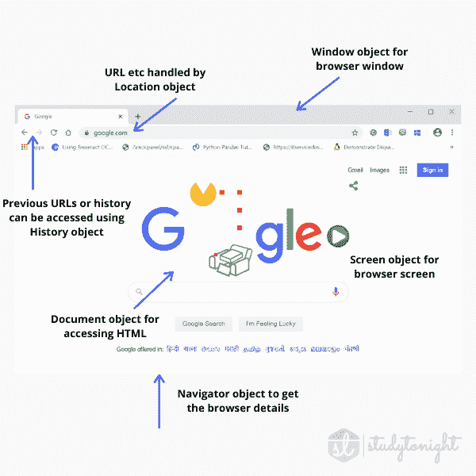

# 浏览器对象模型

> 原文：<https://www.studytonight.com/javascript/javascript-browser-object-model>

JavaScript 提供了我们在开发 web 应用程序或网站时可以使用的 WebAPIs 和接口(对象类型)。这些 API 和对象帮助我们控制网页的生命周期，并执行各种操作，如获取浏览器信息、管理屏幕大小、打开和关闭新的浏览器窗口、获取 URL 信息或更新 URL、获取 cookies 和本地存储等。

使用这些网络应用编程接口和接口可以做很多事情。所有支持的网页应用编程接口和 JavaScript 接口都在 [Mozilla 开发者网站](https://developer.mozilla.org/en-US/docs/Web/API)上列出。

帮助我们**与浏览器窗口**交互的界面(对象类型)被称为**浏览器对象**。浏览器对象不是一个官方术语，而是属于不同网络应用编程接口的一组对象，用于管理各种与浏览器相关的信息和操作。

例如，当在浏览器窗口中打开一个 HTML 文档时，浏览器将该文档解释为分层对象(HTML 标记)的集合，并相应地显示这些对象中包含的数据(HTML 页面呈现)。浏览器解析文档并创建一个对象集合，该集合定义了文档及其详细信息。我们在下图中展示了可用于访问浏览器窗口各种组件的各种对象:

浏览器对象有各种类型，用于与浏览器交互，属于不同的 API。这些浏览器对象的集合也被称为**浏览器对象模型** (BOM)。

浏览器的默认对象是窗口，这意味着你可以直接调用它的函数。

## 浏览器对象:

下面列出的对象称为浏览器对象。

*   窗口 DOM 应用编程接口的一部分

*   航海家

*   文档 DOM 应用编程接口的一部分

*   窗口对象的屏幕属性

*   窗口对象的历史属性

*   窗口和文档对象的位置属性

### 窗口对象

它用于与显示网页的浏览器窗口进行交互。一般**代表浏览器**中的一个选项卡，但是窗口宽度、高度等一些动作会影响整个浏览器窗口。

我们已经分别详细介绍了 JavaScript 窗口对象。

### 导航对象

它作为所有数据的仓库和**关于用于访问网页的浏览器软件的信息**，该对象用于获取与浏览器相关的信息，例如，用户是使用 Chrome 浏览器还是 Safari 浏览器，正在使用哪个版本的浏览器等。

我们已经分别详细介绍了 JavaScript 导航器对象。

### 文档对象

该对象**表示加载到浏览器中的 HTML 文档**。文档对象是提供对文档(网页)的所有 HTML 元素的访问的对象。我们可以用这个对象给网页添加一个新的 HTML 标签，修改任何存在的 HTML 标签，等等。

我们已经分别详细介绍了 JavaScript 文档对象。

### 历史对象

它在浏览器中存储用户访问的统一资源定位符。它是一个内置对象，用于获取浏览器历史记录。该对象是 JavaScript 窗口对象的一个属性。

我们已经分别详细介绍了 JavaScript 历史对象。

### 屏幕对象

它是一个内置对象，用于**获取与浏览器屏幕**相关的信息，如屏幕大小等。它也是从窗口对象获得的。

我们已经分别详细介绍了 JavaScript 屏幕对象。

### 位置对象

位置是一个内置对象，**代表它所链接的对象的位置**，可以是窗口或文档。“文档”和“窗口”界面都有链接位置属性。

我们已经分别详细介绍了 JavaScript 位置对象。

在下一个教程中，我们将一个接一个地详细介绍所有这些对象，并举例说明我们如何使用它们与浏览器交互并执行各种不同的操作。

* * *

* * *