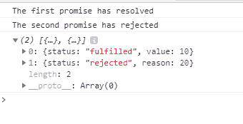

# JavaScript `Promise.allSettled()`方法

> 原文：<https://www.studytonight.com/javascript/javascript-promise-all-settled-method>

**承诺**是**异步操作**的**实现**，用于**管理异步操作**。在 JavaScript 中，每个 Promise 由以下状态组成:

*   完成或解决(成功操作)

*   拒绝(失败操作)

*   既不满足也不拒绝

在继续之前，你应该先介绍一下 [Javascript Promise](https://www.studytonight.com/post/understanding-promises-in-javascript-for-beginners) 和[处理 Promise](https://www.studytonight.com/post/prototype-methods-for-promise-in-javascript-with-examples) 状态的方法。

ES6 或 ES2015 中**承诺**类执行的**方法有`all()`、`reject`、`resolve`等。而`allSettled()`方法在 **ECMAScript 2020** 中介绍。**

`Promise.allSettled()`方法接受一系列**承诺****返回**一个**新承诺****解决**在所有**输入承诺都解决**之后，要么**解决**要么**拒绝**。

简单来说，我们可以说这个函数可以用来监控和报告承诺列表的状态。

当我们有多个异步任务时，使用这个方法。这些异步任务并不相互依赖才能成功完成。当我们想知道每个诺言的结果时，也可以使用这种方法。

相比之下，`Promise.all()`返回的承诺在任务相互依赖时使用。

### `allSettled()`的语法:

下面是我们如何使用这个函数，

```js
Promise.allSettled(iterable);
```

**参数:**

*   一个**可迭代**是一个对象，比如一个数组，其中每个成员都是一个承诺。

**返回值:**

当我们将一个**空可迭代的**作为参数传递给时，`Promise.allSettled()`方法返回一个已经被解析为空数组的 **Promise** 对象。

对于每个**返回的对象**，都有一个状态字符串。如果**状态**属性的值为**满足**，则存在**值**属性，如果**状态属性**的值为**拒绝**，则存在**原因**属性。

**值**(或**原因** ) **属性**决定了每个承诺是否被**履行(或拒绝)**。

### 示例:

在给定的示例中，我们使用了`Promise.allSettled()`方法来等待所有的**输入承诺解决**。

```js
<!DOCTYPE html>
<html>
<head>
	<title>Promise.allSettled() method</title>
</head>
<body>
	<script type="text/javascript">
		const p1 = new Promise((resolve, reject) => {
		setTimeout(() => {
		    console.log('The first promise has resolved');
		    resolve(10);
		}, 1 * 1000);

		});

		const p2 = new Promise((resolve, reject) => {
		setTimeout(() => {
		    console.log('The second promise has rejected');
		    reject(20);
		}, 2 * 1000);
		});

		Promise.allSettled([p1, p2])
		.then((result) => {
		    console.log(result);
		});
	</script>
</body>
</html>
```

### 输出:

正如我们在输出图像中看到的那样，**第一个承诺 p1** **在 1 秒后履行了**的值 10，而**承诺 p2 在 2 秒后被**以原因 20 拒绝。



## 结论:

我们已经了解了 **ECMAScript 2020** 中介绍的`Promise.allSettled()`方法。该方法接受一个承诺列表，并返回一个新的承诺，一旦每个输入的承诺都得到解决，无论是被拒绝还是被履行，该承诺都会得到解决。

* * *

* * *