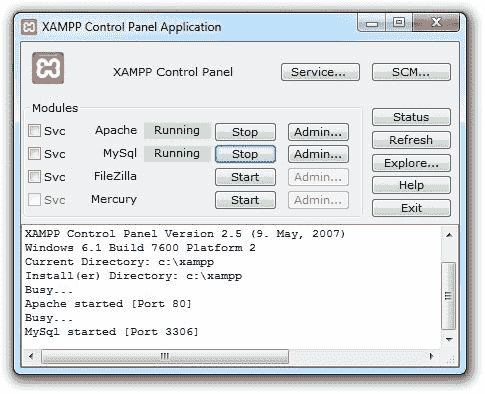
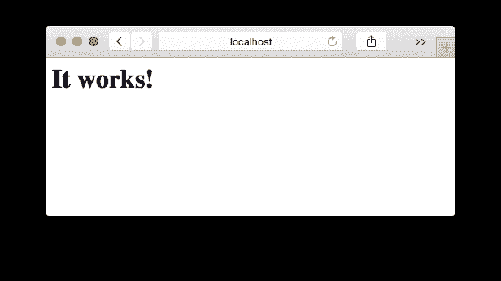

# 在你的本地机器上安装 PHP

> 原文：<https://www.studytonight.com/php/install-php>

要在任何机器(服务器、计算机等)上运行 PHP 脚本，我们需要在其上安装 PHP。在本教程中，我们将学习如何在我们的计算机/笔记本电脑上安装 PHP 并设置开发环境。

* * *

## 对 PHP 的要求

要运行 PHP 脚本，我们需要以下服务:

1.  **PHP 解析器**:要执行 PHP 脚本，需要安装 PHP。
2.  **网络服务器**:由于 [PHP](introduction-to-php) 主要用于开发网站，因此其大部分实现都与 Apache 网络服务器捆绑在一起，Apache 网络服务器是托管通过 HTTP 用 PHP 开发的应用程序所必需的。
3.  **数据库**:任何一个数据库管理系统，一般都是 MySQL，因为 PHP 自带对 [MySQL](php-with-mysql) 的原生支持

现在，您可以自己单独安装所有 3 个服务，或者您可以简单地下载并安装自动安装上述所有服务的软件。

最受欢迎的此类软件包是 **XAMPP** 。

* * *

## 什么是 XAMPP？

XAMPP 代表:

**X** :跨平台，因为它支持 Windows、Mac OSX、Linux 等所有现代操作系统。

**A** :阿帕奇网络服务器

**M** : MySQL 数据库管理系统。

**P** : PHP 安装

**P** : Perl 脚本语言

你可以从[这个链接](https://www.apachefriends.org/download.html)轻松下载安装 XAMPP。安装过程很简单，一旦安装，您将看到一个像这样的小窗口，显示正在运行的各种服务的状态。

您可以使用 XAMPP 控制面板轻松控制、停止和重启各种服务。

安装成功后，将在 c 盘创建一个名为 **xampp** 的文件夹(默认)。在 **xampp** 文件夹中有很多子文件夹，如 apache、cgi-bin、FileZillaFTP 等，但最重要的子文件夹是:

1.  **htdocs** :这是我们将保存所有 PHP 文件的文件夹。
2.  **mysql** :这个文件夹包含了 mysql 数据库的所有文件。默认情况下，MySQL 数据库运行在端口号 3306 上。
3.  **php** :这个文件夹保存了 php 的所有安装文件。当前 PHP 安装的所有配置都保存在 **php.ini** 文件中，该文件存储在该文件夹中。

如果一切正常，并且 apache 服务器正在运行(检查 XAMPP 控制面板)，打开您的**网络浏览器**，在地址栏中输入`localhost`，然后按回车键。您将看到 Apache 网络服务器的默认页面。

* * *

## 其他软件包

XAMPP 不是唯一可用的软件包，尽管它是使用最广泛的软件包。以下是您可以下载和安装的其他一些特定于操作系统的选项:

*   **[【WAMP】](http://www.wampserver.com/en/)**:是给 Windows 用的(Window、Apache、MySQL、PHP)
*   **[【MAMP】](https://www.mamp.info/en/downloads/)**:是给 Mac OSX 的(Macintosh、Apache、MySQL、PHP)
*   **[【LAMP】](http://csg.sph.umich.edu/abecasis/LAMP/download/)**:是给 Linux 用的(Linux、Apache、MySQL、PHP)

* * *

## 编写 PHP 代码的集成开发环境或编辑器

由于 PHP 代码没有编译，您甚至可以使用记事本这样的简单编辑器来创建 PHP 代码文件。但是有一个外观漂亮的编辑器总是好的，它可以突出显示代码，在编码时为您提供建议，甚至在编写代码时分析代码的语法错误。

在我们检查 ide 和编辑器的列表之前，我们必须知道两者之间的区别。一个**编辑器**是一个简单的文本编辑器，具有增强的功能，如语法高亮等，许多现代编辑器也允许特定语言的插件下载，以支持更多的功能。

而 **IDE** 是一个集成开发环境，它是一个独立的包，允许您在同一个地方编写、编译、执行和调试代码。

因此，如果你想要一个轻量级的软件，去任何编辑器，如果你想要一个轻量级的 IDE，你可以从下面的列表中选择任何一个。

这里有几个好的 ide 和编辑器:

1.  netbeans ide
2.  [Eclipse IDE](https://www.eclipse.org/downloads/packages/eclipse-php-developers/oxygen2)
3.  [暴风雨在这里](https://www.jetbrains.com/phpstorm/)
4.  [原子编辑器](https://atom.io/)
5.  [括号编辑器](http://brackets.io/)
6.  [记事本++](https://notepad-plus-plus.org/)
7.  [升华文字](http://www.sublimetext.com/)

下载并安装任何你想要的。我个人使用的是 **Atom** 编辑器，因为它的闪电速度很快，附带了一些惊人的主题选项和插件。

* * *

* * *