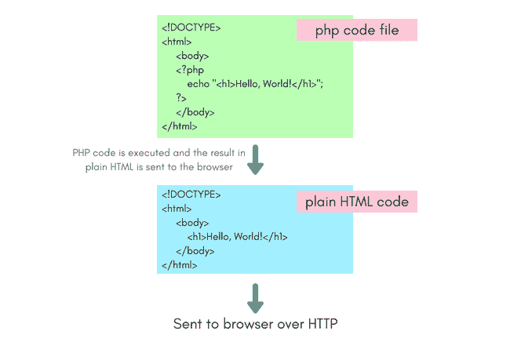

# 第一个 PHP 示例

> 原文：<https://www.studytonight.com/php/first-php-example>

在本教程中，我们将学习编写基本 PHP 代码的语法，如何将 PHP 代码集成到一个 [HTML](/code/html/) 文件中，以及如何运行 PHP 脚本并在浏览器中检查输出。

您必须安装并运行 XAMPP，PHP 脚本才能工作。如果你没有安装 XAMPP，去[最后一个教程](install-php)安装 XAMPP。

* * *

## PHP 中的 Hello World 脚本

所有的 php 代码都写在 php `<code>`标签里面，也就是`<?php`和`?>`。带有 php 代码的文件以扩展名`.php`保存。这里有一个简单的例子:

```
<?php
// code statements
?>
```

于是一句简单的**你好，世界！**用 PHP 编写的程序将是:

```
<?php
echo "Hello, World!";
?>
```

你好，世界！

`echo`是 PHP 中用来在屏幕上显示任何内容的命令。

如果我们想在一个 HTML 文档中包含这个 php 代码，我们可以这样做:

```
<!DOCTYPE>  
<html>  
    <body>  
    <?php  
        echo "<h1>Hello, World!</h1>";  
    ?>  
    </body>  
</html>
```

现在复制上面的代码，粘贴到你的代码编辑器或者 IDE 中，保存名为 **hello_world.php** 的文件

现在进入你安装 XAMPP 的 C 目录，打开 **xampp → htdocs** ，新建一个名为**study night**的文件夹，将你的 php 代码文件 **hello_world.php** 放入**study night**文件夹。

现在访问浏览器中的以下链接:**本地主机/今晚学习/hello_world.php** 您将看到 **Hello，world！**写在屏幕上。注意*你好，世界！*被写成一个标题，因为在 HTML 代码中我们指定了*你好，世界！*应打印为标题，将其放在标题标签`<h1>`内



* * *

## PHP 语法规则

下面我们列出了编写 php 代码时必须遵循的主要语法规则。

1.  All the php code in a php script should be enclosed within `<?php` and `?>`, else it will not be considered as php code. Adding php code inside the PHP tags is known as **Escaping to php**.

    ```
    <?php  ...   ?>
    ```

    除了标准的`<?php`和`?>`外，还可以使用**短开标签**:

    ```
    <?  ...   ?>
    ```

    或者使用 HTML `<script>` 标签，就像我们在 HTML 文档中添加 javascript 代码一样:

    ```
    <script language="PHP">  ...   </script>
    ```

3.  PHP 中的每个表达式都以分号结束

5.  **Commenting PHP code**: Both single line and multi-line comments are supported in PHP. For single line comment, we can either use `#` or `//` before the comment line. For example,

    ```
    <?php
        # This is also a single line comment
        # another line of comment

        // This is a single line comment
        echo "Example for Single line Comments";
    ?>
    ```

    而对于多行评论，我们用`/* ... */`。例如，

    ```
    <?php
        /*
            This is also a single line comment
            another line of comment
        */
        echo "Example for Multi-line Comments";
    ?>
    ```

7.  **PHP is case sensitive**, which means that a variable `$tiger` is not same as `$Tiger`. Both of these, represent two different variables here.

    但是所有预定义的关键字和函数如`if`、`else`、`echo`等都不区分大小写。

    ```
    <?php
        echo "Hello, World!";
        ECHO "Hello, World!";
    ?>
    ```

    你好，世界！你好，世界！

9.  PHP uses **curly braces to define a code block**.

    ```
    <?php
        if($zero == 0)
        {
            echo "If condition satisfied";
            echo "This is a code block";
        }
    ?>
    ```

    不用担心我们会详细了解 [`if...else`](php-if-else-elseif) 的情况，这只是为了演示花括号的用法。

* * *

* * *