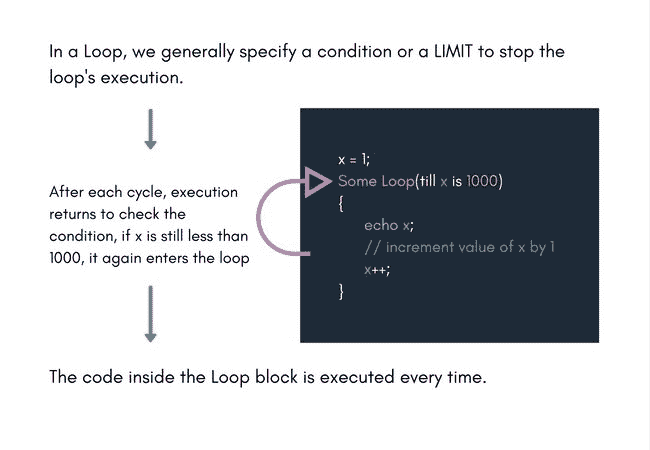

# PHP `while`和`do-...while`循环

> 原文：<https://www.studytonight.com/php/php-while-and-dowhile-loop>

顾名思义，一个**循环**用来一遍又一遍地执行某件事情。

例如，如果您想显示从 1 到 1000 的所有数字，而不是使用`echo`语句 1000 次，或者在一个带有换行符`\n`的`echo`语句中指定所有数字，我们可以只使用一个循环，它将运行 1000 次，每次都会显示一个数字，从 1 开始，在每次迭代或循环后递增该数字。

在循环中，我们通常会指定一个条件或一个极限，直到循环执行为止，因为如果我们不指定这样的条件，我们将如何指定循环应该何时结束，而不是无限长的时间。



* * *

## PHP `while`循环

PHP 中的`while`循环有两个组成部分，一个是条件，另一个是要执行的代码。它执行给定的代码，直到指定的条件为真。

**语法:**

```
<?php
while(condition)
{
    /* 
        execute this code till the  
        condition is true
    */
}
?>
```

例如，让我们以本教程开头提到的问题为例。让我们打印从 1 到 10 的数字。

```
<?php

$a = 1;

while($a <= 10)
{
    echo "$a | ";
    $a++;   // incrementing value of a by 1
}
?>
```

1 | 2 | 3 | 4 | 5 | 6 | 7 | 8 | 9 | 10 |

**注**:我们增加了一个符号`|`只是为了分隔数字，它在上面的代码中没有功能用途。

* * *

## PHP `do...while`循环

`do...while`循环和 PHP 中所有的循环都有点不一样，因为它至少会执行一次，即使条件是假的，你能猜到怎么执行吗？因为条件是在循环执行后检查的，所以第一次检查条件时，循环已经执行了一次。

**语法:**

```
<?php
do {
    /* 
        execute this code till the  
        condition is true
    */
} while(condition)
?>
```

让我们使用`do...while`循环实现上面的例子，

```
<?php

$a = 1;

do {
    echo "$a | ";
    $a++;   // incrementing value of a by 1
} while($a <= 10)
?>
```

1 | 2 | 3 | 4 | 5 | 6 | 7 | 8 | 9 | 10 |

我们再举一个例子，即使条件是**假**，循环还是会执行一次。

```
<?php

$a = 11;

do {
    echo $a;
    $a++;   // incrementing value of a by 1
} while($a <= 10)
?>
```

Eleven

我们可以清楚地看到，上述`do...while`循环中的条件将返回**假**，因为变量`$a`的值为 **11** ，根据该条件，只有当`$a`的值小于或等于 **10** 时，循环才应执行。

* * *

* * *