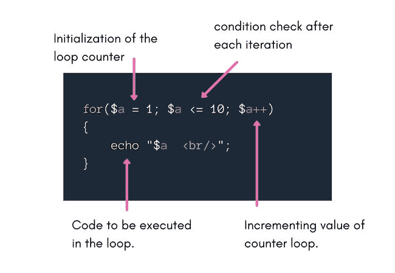

# PHP for 和 foreach 循环

> 原文：<https://www.studytonight.com/php/php-for-and-foreach-loop>

在本教程中，我们将学习`for`和`foreach`循环，它们也用于在 PHP 中实现循环。

为了理解什么是循环以及它们是如何工作的，我们建议您阅读。

* * *

## PHP `for`循环

PHP 中的`for`循环不像`while`或`do...while`循环那样工作，在`for`循环的情况下，我们必须事先声明我们希望循环运行多少次。

**语法:**

```
<?php
for(initialization; condition; increment/decrement)
{
    /* 
        execute this code till the  
        condition is true
    */
}
?>
```

使用的参数具有以下含义:

1.  **初始化**:这里我们用某个值初始化一个变量。这个变量充当循环计数器。
2.  **条件**:这里我们定义了循环每次迭代/循环后检查的条件。如果条件返回**真**，则只执行循环。
3.  **递增/递减**:这里我们根据需要递增或递减循环计数器。



* * *

### 举个例子

同样，让我们尝试打印从 1 到 10 的数字，这次我们将使用`for`循环。

```
<?php

for($a = 1; $a <= 10; $a++)
{
    echo "$a <br/>";
}
?>
```

1 2 3 4 5 6 7 8 9 10

* * *

## 嵌套`for`循环

我们也可以在另一个`for`循环中使用一个`for`循环。这里有一个嵌套`for`循环的简单例子。

```
<?php

for($a = 0; $a <= 2; $a++)
{
    for($b = 0; $b <= 2; $b++)
    {
        echo "$b $a 
";
    }
}

?>
```

0 0 1 0 2 0 0 1 1 1 2 1 0 2 1 2 2 2

* * *

## PHP `foreach`循环

PHP 中的`foreach`循环用于访问一个[数组](php-arrays)的键值对。这个循环只对数组起作用，你不需要初始化任何循环计数器或者设置任何退出循环的条件，一切都是由循环隐式(内部)完成的。

**语法:**

```
<?php
foreach($array as $var)
{
    /* 
        execute this code for all the
        array elements

        $var will represent all the array
        elements starting from first element, 
        one by one
    */
}
?>
```

这里有一个简单的例子。

```
<?php

$array = array("Jaguar", "Audi", "Mercedes", "BMW");

foreach($array as $var)
{
    echo "$var <br/>";
}

?>
```

捷豹奥迪奔驰宝马

我们将在接下来的教程中详细了解数组。

* * *

* * *