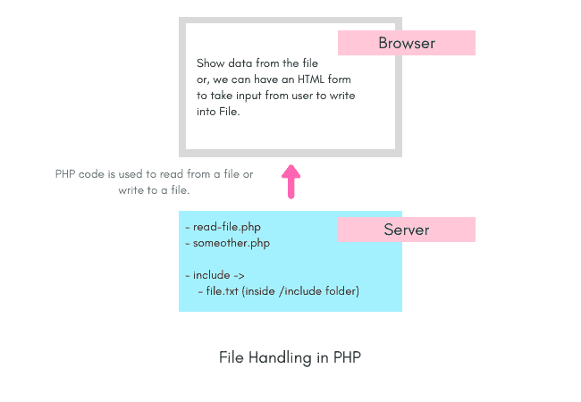

# 用 PHP 创建、打开和关闭文件

> 原文：<https://www.studytonight.com/php/php-file-open-create-close>

创建一个新文件或者打开一个现有文件，我们使用 PHP 提供的`fopen()`函数，关闭一个文件资源使用`fclose()`函数。

* * *

## 用 PHP 创建一个文件

当我们使用函数`fopen()`打开一个不存在的文件时，这个文件就被创建了。

让我们举个例子，

```
$myfile = 'file.txt';
//opens the file.txt file or implicitly creates the file
$handle = fopen($myfile, 'w') or die('Cannot open file: '.$myfile); 
```

`fopen()`函数以**文件名**作为第一个参数，第二个参数代表文件将在其中打开的**模式**。

但是，如果一个文件不存在，而你正在使用`fopen()`创建一个文件，那么你应该保持模式为`w`，也就是写模式。我们将在下一节中了解各种模式。

* * *

## 用 PHP 打开一个文件

打开一个文件，使用同样的`fopen()`功能。打开文件背后可能有许多原因，如读取文件内容、向文件中写入新内容或向文件中已经存在的内容追加附加内容。

让我们举一个简单的例子，然后我们将讨论打开文件的不同模式。

```
$myfile = 'file.txt';
//opens the file.txt file
$handle = fopen($myfile, 'w') or die('Cannot open file: '.$myfile); 
```

同样，`fopen()`函数接受两个强制参数，一个是**文件名**，第二个代表**模式**。

以下是不同的模式以及应该在`fopen()`函数中作为参数传递的字面值。

| 方式 | 字符串字面值 | 描述 |
| 写入模式 | w | 如果文件存在，则打开它以允许在其中进行写操作，如果不存在，则创建一个新文件。在这种模式下，文件中的所有现有数据都会被擦除。 |
| 读取模式 | r | 文件以读取模式打开，文件指针从文件开头开始。 |
| 附加方式 | a | 文件在写入模式下打开，其中文件的现有内容被注意擦除。在现有内容之后添加的新内容。 |
| 创建只写文件 | x | 创建一个具有只写访问权限的新文件。如果文件已经存在，则返回错误。 |

除了上面指定的模式之外，我们可以将`+`与字符串一起添加，以允许给定模式的读写(默认)操作。

例如，`r+`模式打开文件进行读写。`w+`、`a+`分别允许对文件进行读操作以及默认的写和追加操作。

从技术上讲，文件是不打开的，`fopen()`将资源(文件)绑定到一个流，然后可以用这个流从文件中读取数据或将数据写入文件。

此外，如果文件是本地文件，**文件名**应该是完全限定名以及相对路径。**文件名**也可以是指定远程域路径的网址。在这种情况下，一旦 PHP 意识到文件路径不是本地的，它将在 **php.ini** (PHP 的配置文件)中检查`allow_url_fopen`属性值。如果是**假**，PHP 会打印警告，`fopen()`调用会失败。

* * *

## 用 PHP 关闭一个文件

使用文件资源后将其关闭是一个很好的做法。在 PHP 中`fclose()`函数用于关闭一个文件资源。它以文件名作为参数，或者以保存文件资源指针的变量作为参数。让我们举个例子:

```
$myfile = 'file.txt';
//opens the file.txt file or implicitly creates the file
$handle = fopen($myfile, 'w') or die('Cannot open file: '.$myfile); 

// closing a file
fclose($handle); 
```

* * *

## 举个例子

让我们举一个简单的例子，我们将创建一个 PHP 文件来创建一个文本文件，然后打开同一个文件在其中写入内容。

在下图中，我们描述了目录结构，这将帮助您理解如何提供文件的路径并在 PHP 文件中使用它。



下面是我们将保存在**read-file.php**文件中打开**文件. txt** 文本文件在其中写入数据的代码。

```
$myfile = 'include/file.txt';
//opens the file.txt file
$handle = fopen($myfile, 'w') or die('Cannot open file: '.$myfile);
// close a file
fclose($handle); 
```

我们可以为要读取的文件提供完整的路径，也可以像上面的例子一样提供相对路径。

在接下来的教程中，我们将学习如何**读取**、**写入**、**将**数据追加到文件中。

* * *

* * *